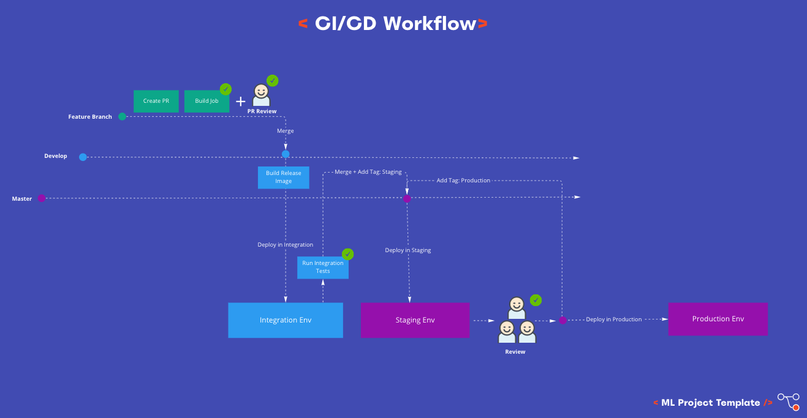

This project contains a blueprint of a production ML structure. Also can guide a user how to organize their code to follow CI/CD best practices.
The structure is designed to support a project with multiple data sources, models and ML pipelines.

# Target Audience :loudspeaker:
* Data Engineers
* Data Scientists
* Data Analysts
* Software Engineers
* MLOps Engineers
* Machine Learning (ML) Engineers
# Introduction
In production based applications the automation in building, testing and deployment is crusial.
The less automated the project lifecycle is the more time consuming and error prone is.
For this reason, the modern CI/CD practices are more relevant than ever.

So, before go into project structure details let's give a look of a CI/CD.

# Suggested Technology Stack
* **Running Environment**: Docker/AKS
* **Programming language**: Python
* **Python Virtual Environment**: Pyenv/Conda

***NOTE:** The blueprint example is based on Python but can be generallized in every modern object oriented language*
# CI/CD Flow Suggestion :factory:
The first thing before start describing the CI/CD pipelines, is to establish the
CI/CD strategy of the project. Also, it's worth to mention that production based applications should have different enviroments for testing defore the final deployment.
For that purpose, we are suggesting to use the following environments:
* **Development (not included in the diagrams)**: Development environment is used only for development team for testing new features before adapt other environments or open a PR
* **Integration**: Used for automated integration tests (no manual interactions)
* **Staging**: A replica of Production environment and a full environment to interact.
Usually it's only open to development team and key stake holders for their testing. Also, it's open for user/stakeholder acceptance testing
* **Production**: Open to all who have access.



***NOTE 1:** The below CI/CD flow is also a blueprint. Each project has specific needs and compliance policies which has to follow*
***NOTE 2:** The below CI/CD flow does not contain the model train/re-train because its a different process. Will described in different section*


  * **Continues Integration (CI)**
    * In Feature branch
      * Build Docker image
      * Run unittests (in Docker image)
      * Run other checks, e.g SonarCube, Snik (in Docker image)
      * Merge feature_branch to develop
    * In Develop branch (Runs in: Integration env)
      * Create a Release Docker image
      * Run integration tests
      * Merge develop to master
    * In Master branch
      * Tag the latest commit with `Staging`
      * Deploy the new release Docker image in Staging env
      * Acceptance test
    * **Continues Delivery (CD)**
      * Add a tag `Production` in the `Staging` commit
      * Deploy the release Docker image in Production env


# Project Structure :oncoming_automobile:

In high level the main components of a ML production project are:

```
|-- cicd        <-- CI/CD (packaging, scripts & configurations)
|-- notebooks   <-- Explanatory analysis & new models POC
|-- tests       <-- Code testing (unit & integration)
|-- src         <-- Source code for production use
```

The full structure of the project is:
```
|-- LICENCE
|-- README.md                     <-- General project README with instructions for project running & installation.
|-- .gitignore
|-- notebooks                     <-- Can be used for creating POC Jupyter notebooks before promote the model to production.
|   |-- dummy_data                <-- A subset of data, used for initial testing. Actual large datasets should not pushed into repo.
|   |-- model_poc.ipynb
|-- cicd/
|   |-- README.md                  <-- Specific README which contains instuctions for CI/CD flows and processes
|   |-- build/
|   |   |-- utils/                 <-- A placeholder directory. Can be used for generic scripts which can be leveraged from both build/release
|   |   |-- docker/
|   |   |  |-- .dockerignore
|   |   |  |-- Dockerfile          <-- This Dockerfile will create the build image for testing.
|   |   |                               It will contain source code, tests, Sonar (if used) etc
|   |   |-- build.sh               <-- This is the main script for the build process
|   |-- release/
|       |-- docker/
|       |   |-- .dockerignore
|       |   |-- Dockerfile         <-- This Dockerfile will create the release image. 
|       |                              This image will be the final image with the Python package (not source code, tests, Sonar etc)
|       |-- release.sh
|-- src/                          
    |-- MANIFEST.in                <--|
    |-- pyproject.toml             <--|
    |-- setup.py                   <--|__ These files are used for Python package build (.whl file)
    |                                     More info found: https://packaging.python.org/en/latest/tutorials/packaging-projects/
    |-- requirements/              <-- This folder contains all the project requirements. For now have only 2 files for pip install.
    |   |-- default.txt            <-- Contains all the project requirements which need to be downloaded e.g Numpy, Pandas, Sklearn
    |   |-- dev.txt                <-- Contains the extra requirements which needed only in development env and not in production
    |                                  For example flake8, pylint
    |-- tests/                     <-- This package contains all the unittests and integration tests.
    |   |-- __init__.py
    |   |-- .coveragerc            <-- Unittest coverage configuration
    |   |-- unit/                  <-- This module contains all the unittests.
    |                                  Tests which test specific components (side effects are mocked)
    |   |   |-- __init__.py
    |   |   |-- ...
    |   |-- integration/          <-- This module contains all integration tests.
    |   |                             Tests which test the whole application behaviour wihtout mocking side effects
    |   |   |-- __init__.py
    |   |   |-- ...        
    |   |-- run_tests.py           <-- Run tests cli. All the tests run from here by passing different arguments.
    |                                  For example, python run_tests.py --test_type --intergration
    |-- <PYTHON_PACKAGE_NAME>      <-- Replace the <PYTHON_PACKAGE_NAME> with your project package name.
        |                              Don't forget to follow the PEP8 Python package name convention:
        |                              https://visualgit.readthedocs.io/en/latest/pages/naming_convention.html#packages
        |-- __init__.py 
        |-- data_loaders/           <-- This package contains different data loaders for different sources, e.g CSV files, SQL
        |   |-- __init__.py          
        |   |-- data_loader.py      <-- This module is the abstarct data loader. All the other data_loaders are implementations.
        |   |-- csv_data_loader.py  <-- This module is a specific implementation of the DataLoader() class.
        |   |                           The naming convention of the implementation is xxx_data_loader.py
        |   |-- ...
        |-- models/                 <-- This package contains different packages of different models. 
        |   |                           The models are separated by general model families type e.g regression, boosting ..
        |   |-- __init__.py
        |   |-- common/             <-- This package contains common scripts/helpers between different models.
        |   |   |-- __init__.py
        |   |   |-- ...
        |   |-- rule_based/
        |   |   |-- __init__.py
        |   |   |-- naive_model.py
        |   |   |-- ...
        |   |-- regression/
        |   |   |-- __init__.py
        |   |   |-- olsr_regressor.py
        |   |   |-- ...
        |   |-- ensemble/
        |   |   |-- __init__.py
        |   |   |-- random_forests/
        |   |   |   |-- __init__.py
        |   |   |   | -- no_features.py
        |   |   |   | -- all_features.py
        |   |   |   |-- ...
        |   |   |-- boosting/
        |   |   |   |-- __init__.py
        |   |   |   |-- ...
        |   |   |-- ...
        |   |-- ...
        |
        |-- features/              <-- This package contains different processing flows for different features
        |   |-- __init__.py
        |   |-- common/
        |   |   |-- __init__.py
        |   |-- build_feature_one/
        |   |   |-- __init__.py
        |   |   |-- prefilter.py
        |   |   |-- filter.py
        |   |   |-- portfilter.py
        |   |   |-- processor.py
        |   |-- build_features_two/
        |       |-- __init__.py
        |       |-- tokenizer.py
        |-- pipelines/              <-- This package contains all the "modes" the application can run.
        |   |                           In a pipeline we merge, all the classed from models and features and we create pipelines
        |   |-- __init__.py
        |   |-- train.py
        |   |-- predict.py
        |   |-- evaluate.py
        |-- run.py                 <-- This is the application CLI.
                                       By providing different command line arguments we can run different pipelines.
```

# Contributing
Pull Requests (PRs) are welcome ☺️!
# Thanks!
Thanks for your time! This repo is trying to be generic and cover the basics without beeing too complex! Cheers 🍻